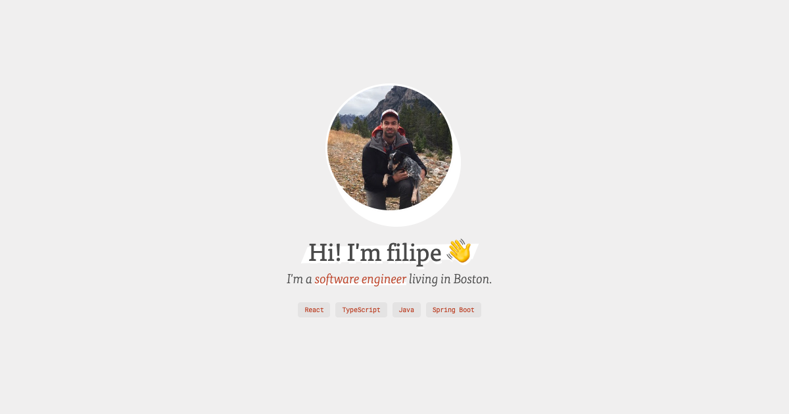

# [fmpm.dev](https://fmpm.dev)

My personal site, built with [Gatsby](https://www.gatsbyjs.org/) and
[TypeScript](https://www.typescriptlang.org/), deployed through zeit.



## Development

You'll need to have the gatsby-cli installed:

```bash
npm install -g gatsby-cli
```

Then proceed as usual:

```bash
yarn
yarn start
```

For isolated component development, you can also use
[Storybook](https://storybook.js.org/):

```bash
yarn storybook
```
